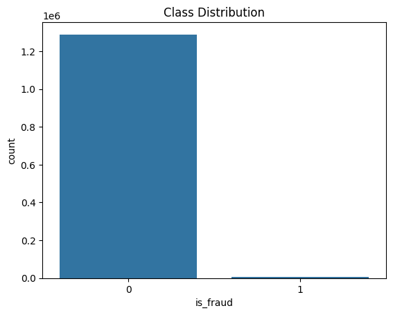

# CodSoft — Machine Learning Internship Projects

This repository contains machine learning tasks completed as part of the **CodSoft Internship (December Batch)**.  
Each task focuses on **core ML concepts**, correct problem formulation, and proper evaluation.

The goal is learning and implementation clarity — not production deployment.

---

## Repository Overview

- Multiple independent ML tasks
- Classical machine learning algorithms
- Emphasis on data understanding and evaluation
- Implemented using Python and scikit-learn

---

## Tasks Included

### Task 1 — Movie Genre Classification
- Problem Type: Text Classification
- Input: Movie descriptions
- Output: Predicted genre
- Core Techniques:
  - Text vectorization
  - Supervised classification
  - Model evaluation

📁 Folder: `Task 1 - Movie Genre Classification/`

---

### Task 2 — Credit Card Fraud Detection
- Problem Type: Binary Classification
- Challenge: Highly imbalanced dataset
- Focus Areas:
  - Handling class imbalance
  - Model evaluation beyond accuracy
  - Understanding false negatives

📁 Folder: `Task_2_Credit_card_fraud_detection/`

---

## Example: Fraud Detection — Data Imbalance

The dataset used for fraud detection is **highly imbalanced**, where fraudulent transactions represent a very small fraction of total data.

### Class Distribution

  

This imbalance makes **accuracy an unreliable metric**, requiring precision, recall, and confusion matrix analysis.

---

## Models Used

Only classical, well-understood ML models are used:

- Logistic Regression
- Decision Trees
- Random Forest (where applicable)

No deep learning models are included.

---

## Evaluation Metrics

Models are evaluated using:
- Confusion Matrix
- Precision
- Recall
- F1-Score

Metrics are chosen based on the **problem characteristics**, especially for imbalanced data.

---

## Repository Structure

CODSOFT/
│
├── Task 1 - Movie Genre Classification/
│
├── Task_2_Credit_card_fraud_detection/
│
├── README.md

Each task folder contains its **own README** explaining:
- Problem statement
- Dataset
- Approach
- Results

---

## Tools & Libraries

- Python
- NumPy
- Pandas
- scikit-learn
- Matplotlib

---
