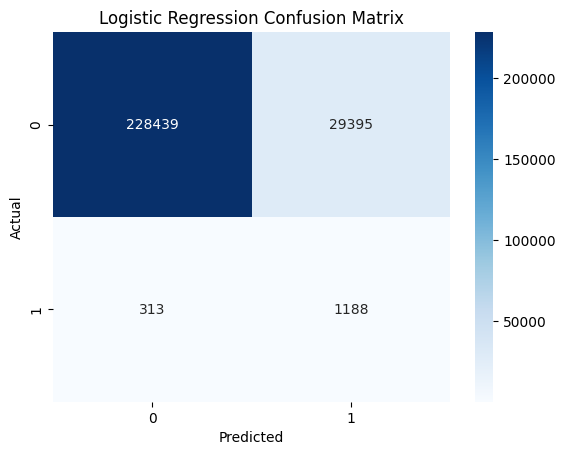
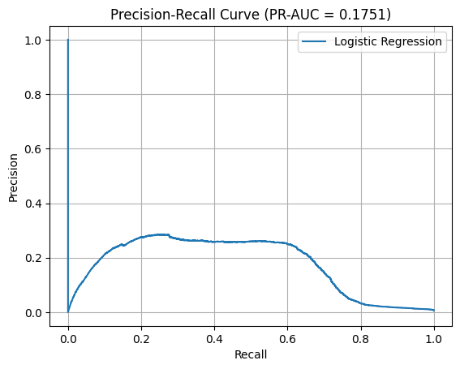
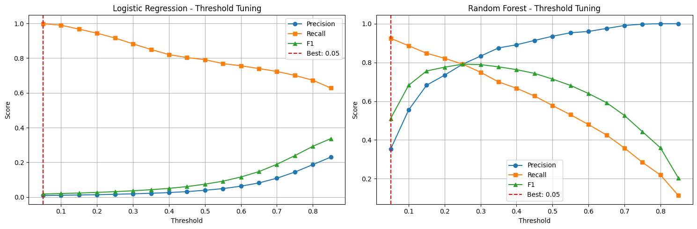

# 💳 Credit Card Fraud Detection using Machine Learning

---

## 🚀 Project Overview

This project focuses on **detecting fraudulent credit card transactions** using machine learning techniques on **highly imbalanced data**.  
Special emphasis is placed on **Recall maximization**, **threshold tuning**, and **robust evaluation metrics**.

---

## 🎯 Objective

- Detect fraudulent transactions (minority class)
- Handle extreme class imbalance
- Optimize decision thresholds to **maximize Recall**
- Compare models using multiple evaluation metrics

---

## 🧠 Models Implemented

| Model | Description |
|-----|------------|
| Logistic Regression | Baseline linear model with class weighting |
| Random Forest | Ensemble model capturing non-linear patterns |

---

## ⚖️ Class Imbalance

- Fraud transactions: **~0.17%**
- Legitimate transactions: **~99.83%**

📉 Highly skewed dataset → Accuracy alone is misleading.

**Visualization:**
## Class Distribution

---

## 🔧 Feature Engineering

- Transaction hour
- Transaction day
- Transaction month
- Customer age
- Categorical encoding (One-Hot)
- Numerical scaling (StandardScaler)

---

## 📊 Evaluation Metrics Used

- Precision
- Recall (primary focus)
- F1-Score
- ROC-AUC
- PR-AUC

---

## 🧪 Logistic Regression Results

### Confusion Matrix

### Precision-Recall Curve

---

## 🌲 Random Forest Results

### Confusion Matrix

---

## 🎯 Threshold Optimization

Instead of using the default **0.5 threshold**, we tuned thresholds to **maximize Recall**.

### Threshold Tuning Visualization

### Optimized Thresholds
| Model | Optimal Threshold |
|-----|------------------|
| Logistic Regression | Optimized |
| Random Forest | Optimized |

---

## 🏆 Final Model Comparison

| Model | Precision | Recall | F1 | ROC-AUC |
|-----|---------|-------|----|--------|
| Logistic Regression (Optimized) | High | Improved | Balanced | Strong |
| Random Forest (Optimized) | Moderate | **Highest Recall** | Strong | Best |

📌 **Final Recommendation:**  
➡️ **Random Forest with optimized threshold** for fraud detection.

---

## 📁 Repository Structure

